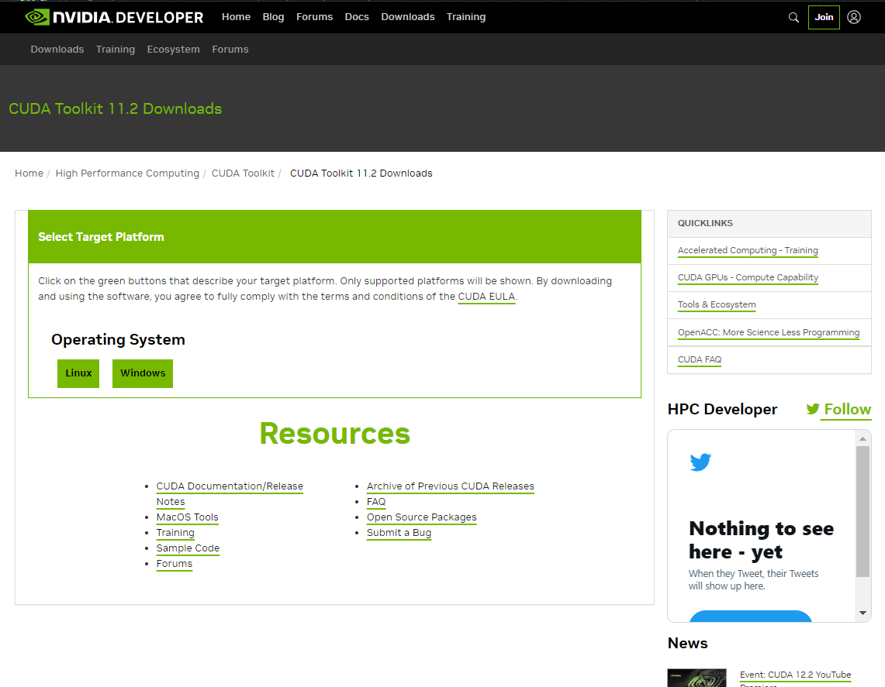
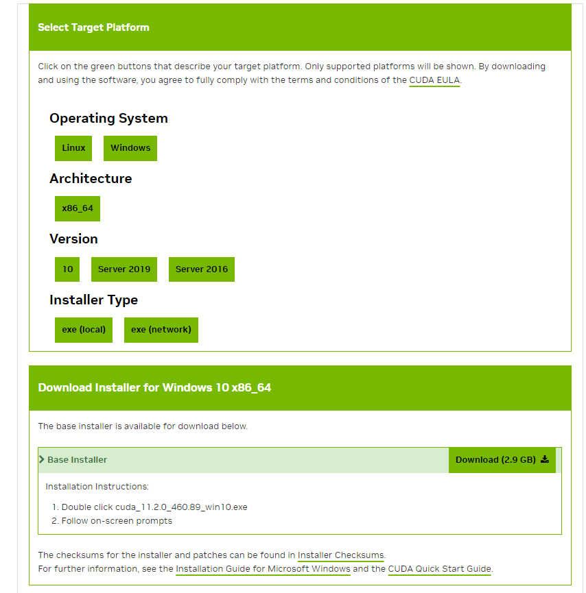

# CUDA Prerequisites

## Cuda Toolkit

1. Visit CUDA web page: [Cuda Toolkit 11.2](https://developer.nvidia.com/cuda-11.2.0-download-archive).

    

2. Select your OS version, Architecture, Distribution/Version and Installer Type

    

3. Download and install [Cuda Toolkit 11.2](https://developer.nvidia.com/cuda-11.2.0-download-archive). Follow the installation steps.

4. After installing the Cuda Toolkit, restart your computer for proper configuration and Cuda settings.
