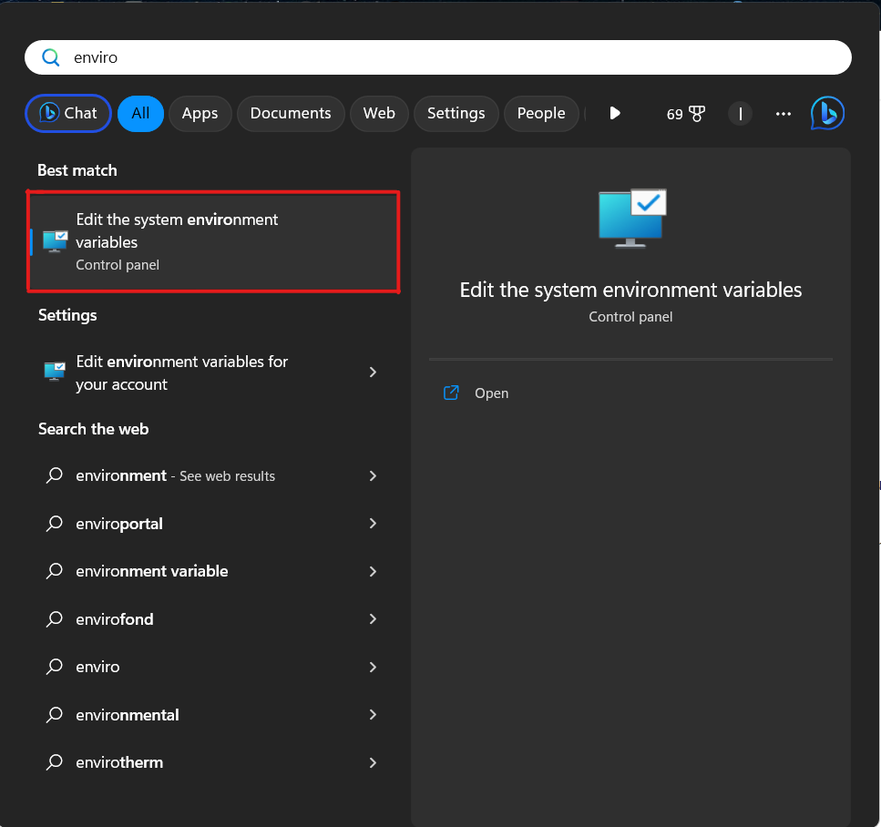

# MONAILabel Server Installation

To install MONAI Label along with additional models for higher-level morphological structure segmentation, follow below steps.

## Using Docker

### Docker prerequisites

To deploy server using Docker you need to install Docker on your computer. This step is different for different operating systems. For this purpose follow the instructions in official [Docker Documentation](https://docs.docker.com/engine/install/).

1. Visit the [Docker Documentation](https://docs.docker.com/engine/install/) page and select the OS you have installed.
  
    

2. Follow the instructions on the appropriate page for the selected OS and install Docker.

### Get Docker Image

1. Pull image from Docker Hub.

```bash
docker pull xvykopal/monailabel-server:latest
```

## Without Docker

### General prerequisites

These prerequisites are necessary when you want to run the server without Docker.

#### Python

First of all, you need to install Python with the verion >=3.9 and setup the Python in your computer's settings.

1. Install [Python](https://www.python.org/downloads/) version >= 3.9.

2. Add the path to Python to the environment variables. The path to Python added to the environment variables should look similar to the following: `C:\Users\{user}\AppData\Local\Programs\Python\{python}`, where `{user}` is replaced with the user identifier within the OS and {python} represents the directory name with the installed Python for a specific version.

  2.1. On Windows, open the **Start** Menu and type, e.g `environment`
  
    

  2.2 Select `Edit the system envirnoment variables`

    

  2.3. Edit `Path` variable mainly for the user, but sometimes it is necessary to edit `Path` variable also in system variables.

    

3. Python should be now available. You can check it in console by running the following command: `python --version`, if there is no error it means that Python was successfully installed.

#### Source code

The next step is to download source code from the GitHub [repository](https://github.com/ivanvykopal/MONAILabel/tree/development).

1. Download the development branch from the [repository](https://github.com/ivanvykopal/MONAILabel/tree/development).

    

    - The first method via `Code` > `Download ZIP`

    

    - The second method via:

        ```bash
        git clone https://github.com/ivanvykopal/MONAILabel.git
        git fetch --all
        git checkout development
        ```

2. After we downloaded the source code, we can create a new python environment:

    - Using the `venv` command:

      ```bash
      virtualenv ".venv/monailabel" -p python3.9.16
      ```

    - Using `conda`

      ```bash
      conda create -n "monailabel" python=3.9.16
      ```

     It is recommended to use [Anaconda](https://www.anaconda.com/products/distribution) or [Miniconda](https://docs.conda.io/en/latest/miniconda.html) for managing multiple environments.

3. Install the packages from `requirements.txt`
    - `venv`

      ```bash
      .venv/monailabel/Scripts/activate
      python -m pip install --upgrade pip
      pip install -r requirements.txt
      ```

    - `conda`

      ```bash
      conda activate monailabel
      python -m pip install --upgrade pip
      pip install -r requirements.txt
      ```

4. To run server, it is needed to download [openslide binaries](https://openslide.org/download/) and extract them to any location. After extraction, add the path to the `bin` directory to the environment variables in `PATH`, as you done for Python.

5. To add the path to the `monailabel\scripts` directory to the `PATH` environment variable, follow the instructions in this [macOS example](https://www.cyberciti.biz/faq/appleosx-bash-unix-change-set-path-environment-variable/). If any `dll` libraries are missing, you can download them from [dll-files.com](https://www.dll-files.com/). Specifically, if you need the missing `cudnn64_8.dll`, you can download it using this [link](https://www.dll-files.com/cudnn64_8.dll.html). After downloading the `dll` files, you need to copy them to the system disk. On Windows systems, the standard location is `C:\Windows\System32`.

#### Weights and Sample Project

To run the inference of the added models, we need to download weigths of the models. To download them, it is necessary to contact [Ivan Vykopal](mailto:ivan.vykopal@gmail.com) or [VGG Research group](https://vgg.fiit.stuba.sk/team/)

1. Download the weights of the models and sample project provided by authors.

2. Add the downloaded weights for `pathology_structure_segmentation_nestedunet` to `apps/pathology/model/pathology_structure_segmentation_nestedunet/models` and add the weights for `pathology_structure_segmentation_deeplabv3plus` to `apps/pathology/model/pathology_structure_segmentation_deeplabv3plus/models`.
