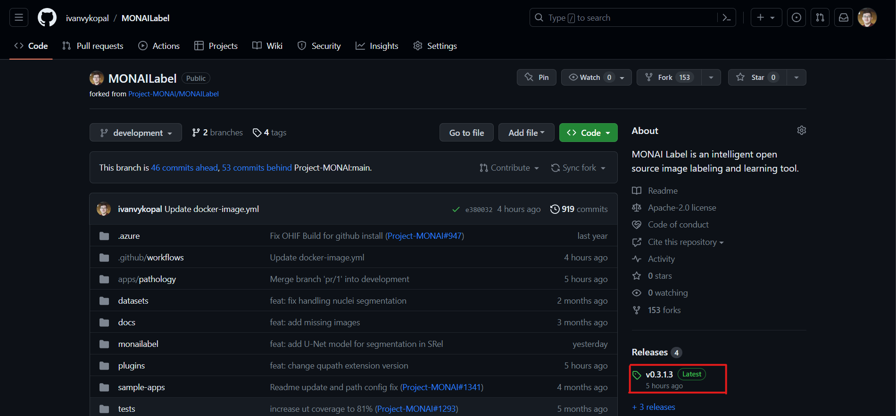
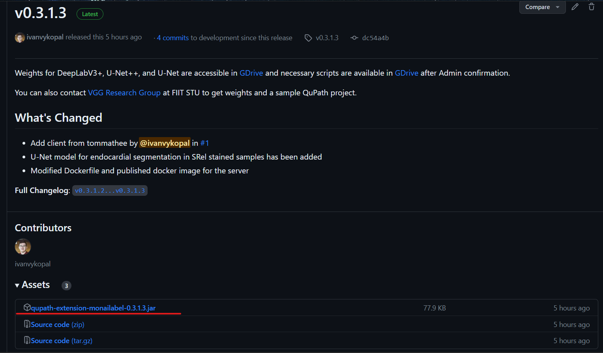

# MONAILabel QuPath extension

1. Download the latest MONAI Label extension for QuPath from the [repository](https://github.com/ivanvykopal/MONAILabel/tags). The latest extension can be found in the latest `Release` as `qupath-extension-monailabel-{version}.jar`, where `version` is the identifier of the latest version, for example, `0.3.1.3`.

    1.1. Click on Releases

    

    1.2. Download latest version

    

2. To add the MONAI Label extension, run QuPath and drag the downloaded file `qupath-extension-monailabel-{version}.jar` into the QuPath area and confirm the dialog window. This will install the MONAI Label extension in QuPath.

3. After launching QuPath, go to `Edit` > `Preferences...` > `MONAI Label` and change the Server URL to `http://0.0.0.0:8000` if the server is running locally or change the Server URL to the provided URL.

    

    
