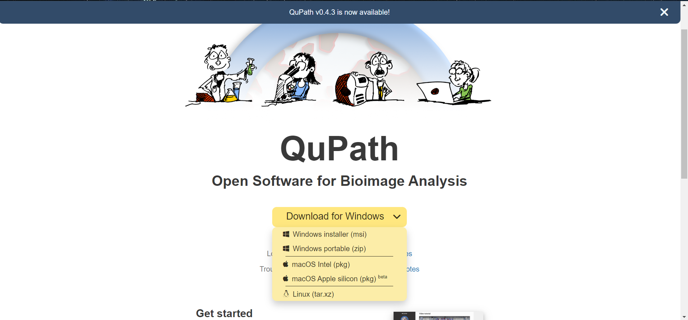

# QuPath Installation

There are steps to download and install the QuPath:

<!-- 1. Download [QuPath](https://qupath.github.io/) from the official website. -->

1. Visit [QuPath](https://qupath.github.io/) web page and select the OS for which you want to install the QuPath tool.

    

2. Download the QuPath tool.

3. After downloading the installer, run the QuPath installation and follow the on-screen instructions.
