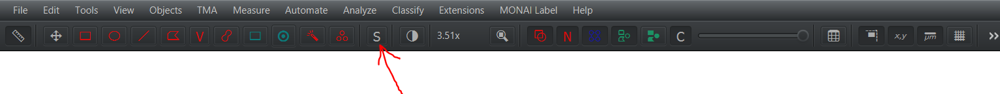

# Segmentation in QuPath

To perform the segmentation of higher-order morphological structures, import WSI (Whole Slide Imaging) images into the QuPath project downloaded during installation.

1. Create annotations for tissue and cells along with their classifications. For this step, you can use the downloaded script.

    To use the downloaded script, `Tissue detection and cell detection.groovy`, open it in the panel `Automate` > `Show script editor`. Once the `Script editor` is open, select `File` > `Open...` and choose the directory where the downloaded scripts are located. Select the script `Tissue detection and cell detection.groovy.` After loading the script, choose the option `Run` to perform tissue and cell segmentation and cell classification.

2. Select the area of the image for which you want to perform prediction.

    

3. Choose `MONAI Label` > `Create annotations...` and then select the model you want to use for prediction in the `Model Name` section.

    The currently available models are:
    - `deeplab_structure` - DeepLabV3+ for predicting vessels, inflammation, and endocardium in H&E images
    - `nestedunet_structure` - U-Net++ for predicting vessels, inflammation, and endocardium in H&E images
    - `srel_segmentation` - U-Net for predicting endocardium in SRel images

    Press `OK` after selecting the model.

    

4. After the prediction is completed, the results are available in QuPath, where you can edit, delete, or manually add missing annotations.

    

To select annotations for deletion, enable `Selection mode` by choosing `S` in the panel. Once `Selection mode` is enabled, you can use various selection methods, such as rectangular selection or brush selection. To cancel `Selection mode`, click `S` again.

