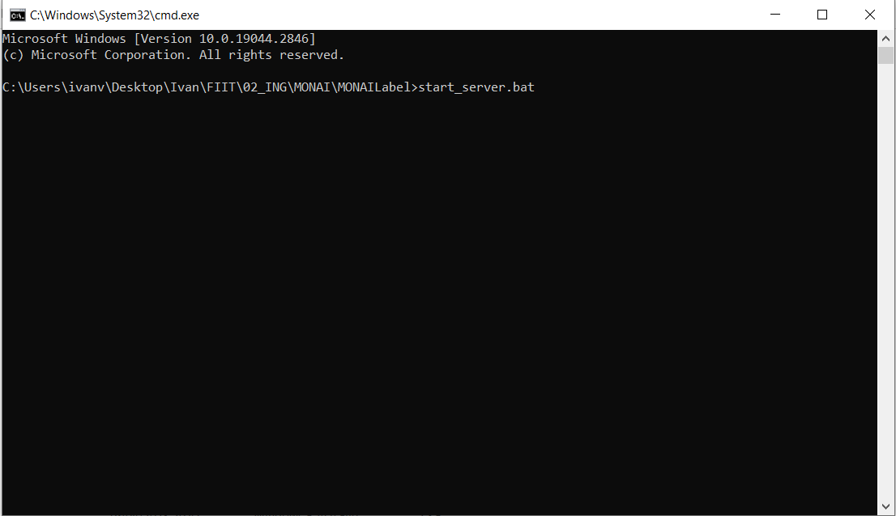

# Running the Server

## Using Docker

The preferred way to run the server is using docker:

```bash
docker run --gpus all --rm -ti -p 8000:8000 xvykopal/monailabel-server:latest bash
```

or you can use the following command, if you have downloaded the source code

```bash
docker compose up
```

## Locally without Docker

The second way to start the server is by using the provided script `start_server.bat`, which can be run with the following command:

```bash
start_server
```

Steps to run server without Docker installed:

1. Open the directory with the saved source code for MONAI Label.

    

2. Then, instead of the file path, enter the command `cmd` in the file explorer.

    

3. After the console appears, type the command `start_server.bat` to start the server.

    

4. After successfully starting the server, you should be able to see the following output in the console.

    

If the server does not start, manual startup is required using the following commands.

Before starting the server, activate the Python environment:

- `venv`

 ```bash
 .venv/monailabel/Scripts/activate
 ```

- `conda`

 ```bash
 conda activate monailabel
 ```

To start the server:

```bash
monailabel/scripts/monailabel start_server --app apps/pathology --studies datasets/
```
