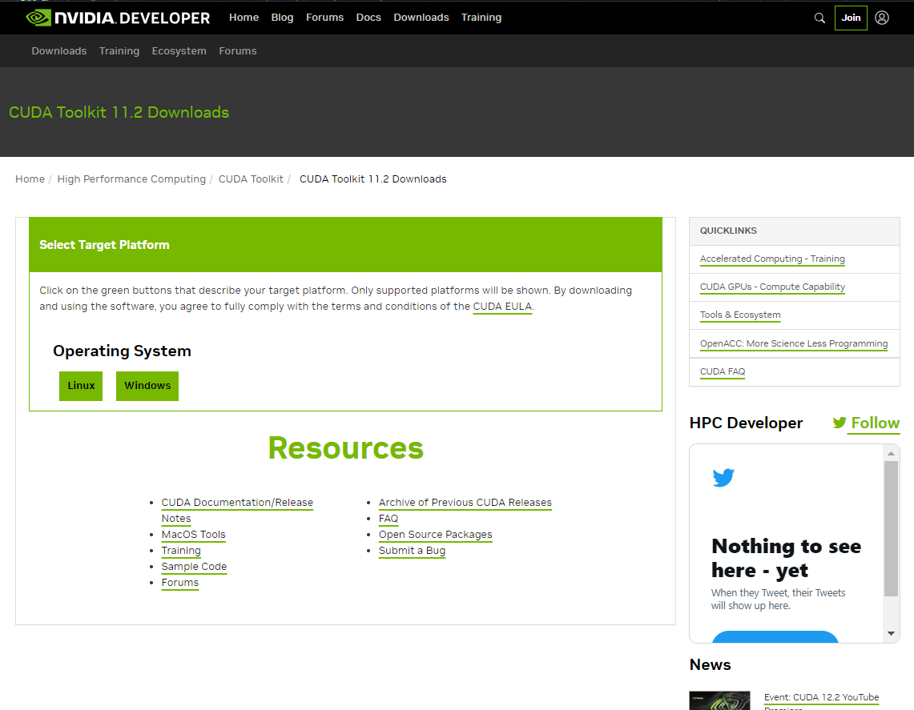
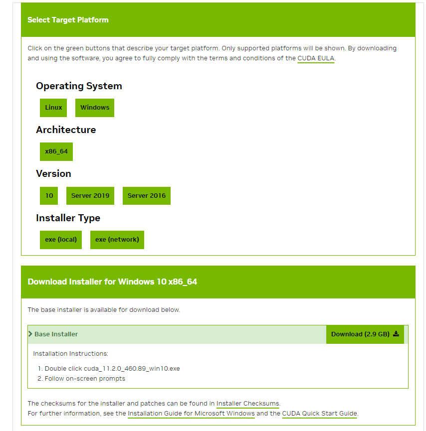

# CUDA Požiadavky

## Cuda Toolkit

1. Navštívte webovú stránku CUDA: [Cuda Toolkit 11.2](https://developer.nvidia.com/cuda-11.2.0-download-archive).

    

2. Vyberte verziu svojho operačného systému, architektúru, distribúciu/verziu a typ inštalátora.

    

3. Stiahnite a nainštalujte [Cuda Toolkit 11.2](https://developer.nvidia.com/cuda-11.2.0-download-archive). Postupujte podľa inštalačných krokov.

4. Po inštalácii CUDA Toolkitu reštartujte váš počítač pre správne nastavenie a konfiguráciu CUDA.
