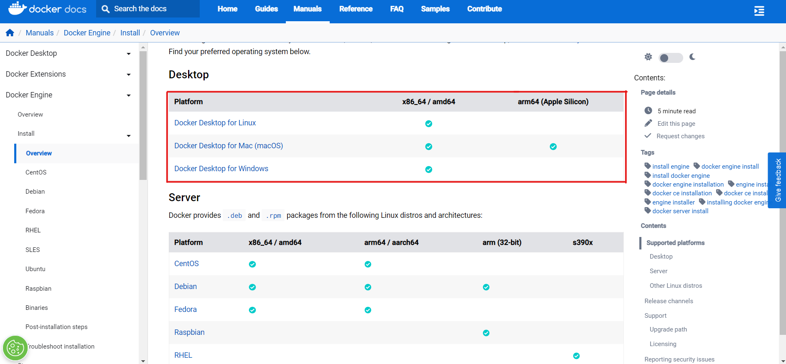

# Inštalácia MONAILabel Server

Pre nainštalovanie MONAI Label spolu s pridanými modelmi pre segmentáciu vyšších morfologických štruktúr postupujte podľa nižšie uvedených krokov.

## S využitím Docker

### Docker požiadavky

Ak chcete nasadiť server pomocou Docker, musíte si nainštalovať Docker na svoj počítač. Tento krok sa líši v závislosti od vášho operačného systému. Pre tento účel postupujte podľa pokynov v oficiálnej [dokumentácie pre Docker](https://docs.docker.com/engine/install/).

1. Navštívte stránku [dokumentácie pre Docker](https://docs.docker.com/engine/install/) a vyberte svoj operačný systém.
  
    

2. Postupujte podľa pokynov na vybranej stránke pre váš operačný systém a nainštalujte Docker.

### Získanie obrazu Dockera

1. Stiahnite obraz z Docker Hub-u.

```bash
docker pull xvykopal/monailabel-server:latest
```

## Bez využitia Docker

### Všeobecné požiadavky

Tieto predpoklady sú nevyhnutné pre spustenie servera bez využitia Docker-u.

#### Python

Najprv je potrebné nainštalovať Python s verziou >=3.9 a nastaviť Python vo vašom počítači.

1. Nainštalujte [Python](https://www.python.org/downloads/) verziu >= 3.9.

2. Pridajte cestu k Python do premenných prostredia. Cesta pre Python, ktorá sa pridáva do premenných prostredia vyzerá podobne nasledovnej: `C:\Users\{user}\AppData\Local\Programs\Python\{python}`, pričom `{user}` je nahradené identifikátorom používateľa v rámci OS a `{python}` predstavuje názov adresára s uloženým Python-om pre konkrétnu verziu.

  2.1. Na systémoch Windows otvorte menu **Štart** a napíšte napríklad `environment`
  
    

  2.2 Vyberte možnosť `Edit the system envirnoment variables`

    

  2.3. Upravte premennú `Path` hlavne pre používateľa, ale niekedy je potrebné upraviť premennú `Path` aj pre systémové premenné prostredia.

    

3. Python by mal byť teraz dostupný. Môžete to overiť v konzole spustením príkazu: `python --version`, ak nevypíše chybu, znamená to, že Python bol úspešne nainštalovaný.

#### Zdrojový kód

Ďalším krokom je stiahnutie zdrojového kódu z GitHub [repozitára](https://github.com/ivanvykopal/MONAILabel/tree/development).

1. Stiahnite si zdrojový kód z [repozitára](https://github.com/ivanvykopal/MONAILabel/tree/development) a konkrétne z vetvy development.

    

    - Prvýspôsob s využitím `Code` > `Download ZIP`

    

    - Druhý spôsob prostredníctvom príkazov:

        ```bash
        git clone https://github.com/ivanvykopal/MONAILabel.git
        git fetch --all
        git checkout development
        ```

2. Po stiahnutí zdrojového kódu môžeme vytvoriť nové Pythonové prostredie:

    - Použitím príkazu `venv`:

      ```bash
      virtualenv ".venv/monailabel" -p python3.9.16
      ```

    - Použitím `conda`

      ```bash
      conda create -n "monailabel" python=3.9.16
      ```

     Odporúča sa používať [Anaconda](https://www.anaconda.com/products/distribution) alebo [Miniconda](https://docs.conda.io/en/latest/miniconda.html) na správu viacerých prostredí.

3. Nainštalujte balíčky z `requirements.txt`
    - `venv`

      ```bash
      .venv/monailabel/Scripts/activate
      python -m pip install --upgrade pip
      pip install -r requirements.txt
      ```

    - `conda`

      ```bash
      conda activate monailabel
      python -m pip install --upgrade pip
      pip install -r requirements.txt
      ```

4. Na spustenie servera je potrebné stiahnuť [binárne súbory pre openslide](https://openslide.org/download/)a extrahovať ich do akéhokoľvek umiestnenia. Po extrakcii pridajte cestu k adresáru `bin` do premenných prostredia v premennej `PATH`, rovnako ako ste urobili pre Python.

5. Ak chcete pridať cestu k adresáru  `monailabel\scripts` do premennej prostredia `PATH` postupujte podobne ako vyššie. V prípade operačného systému macOS postupujte podľa [pokynov](https://www.cyberciti.biz/faq/appleosx-bash-unix-change-set-path-environment-variable/). Ak nie sú k dispozícii niektoré `dll` knižnice, môžete si ich stiahnuť z [dll-files.com](https://www.dll-files.com/). Ak potrebujete konkrétne `cudnn64_8.dll`, môžete si ju stiahnuť pomocou tohto [odkazu](https://www.dll-files.com/cudnn64_8.dll.html). Po stiahnutí `dll` súborov ich musíte skopírovať na systémový disk. Na systémoch Windows je štandardné umiestnenie `C:\Windows\System32`.

#### Váhy a ukážkový projekt

Pre spustenie inferencie pridaných modelov je potrebné stiahnuť váhy modelov. Na stiahnutie váh je potrebné sa obrátiť na [Ivana Vykopala](mailto:ivan.vykopal@gmail.com) alebo [Výskumnú skupinu VGG](https://vgg.fiit.stuba.sk/team/)

1. Stiahnite si váhy modelov a ukážkový projekt poskytnuté autorom.

2. Pridajte stiahnuté váhy pre `pathology_structure_segmentation_nestedunet` do adresára `apps/pathology/model/pathology_structure_segmentation_nestedunet/models` a váhy pre `pathology_structure_segmentation_deeplabv3plus` do adresára `apps/pathology/model/pathology_structure_segmentation_deeplabv3plus/models`.
