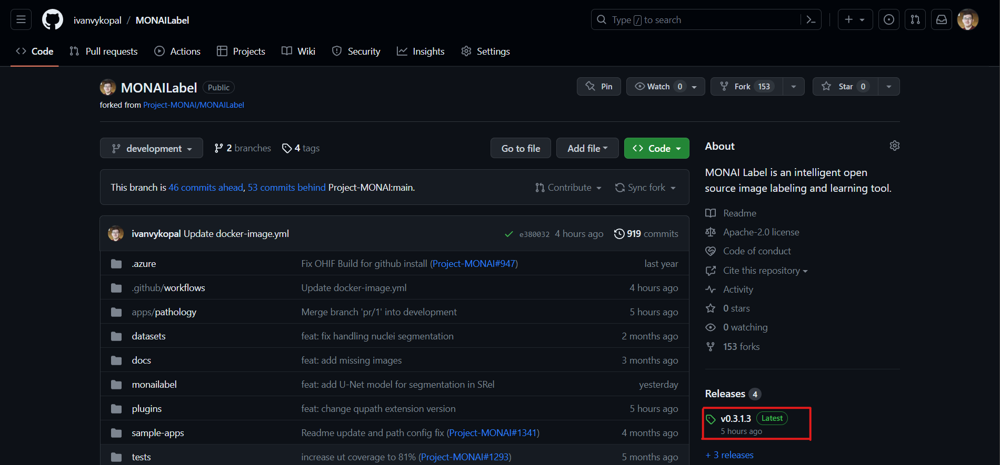

# MONAILabel QuPath extension

1. Stiahnite najnovšie rozšírenie MONAI Label pre QuPath z [repozitára](https://github.com/ivanvykopal/MONAILabel/tags). Najnovšie rozšírenie nájdete v najnovšom `Release`  pod názvom `qupath-extension-monailabel-{version}.jar`, kde  `version`  je identifikátor najnovšej verzie, napríklad , `0.3.1.3`.

    1.1. Kliknite na `Releases`

    

    1.2. Stiahnite najnovšiu verziu

    

2. Aby ste pridali rozšírenie MONAI Label, spustite QuPath a pretiahnite stiahnutý súbor  `qupath-extension-monailabel-{version}.jar` do oblasti aplikácie QuPath a potvrďte dialógové okno. Týmto spôsobom nainštalujete rozšírenie MONAI Label do QuPath.

3. Po spustení QuPath prejdite na `Edit` > `Preferences...` > `MONAI Label` a zmeňte Server URL na `http://0.0.0.0:8000` ak je server spustený lokálne, alebo zmeňte Server URL na poskytnutú URL adresu.

    

    
