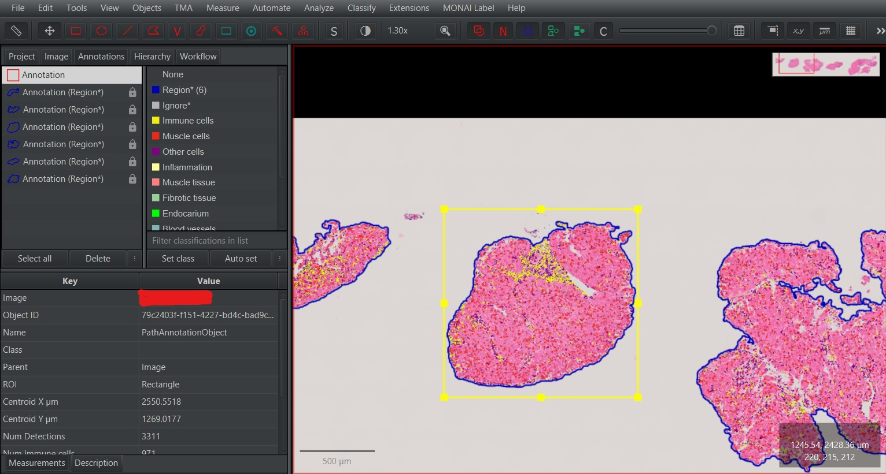
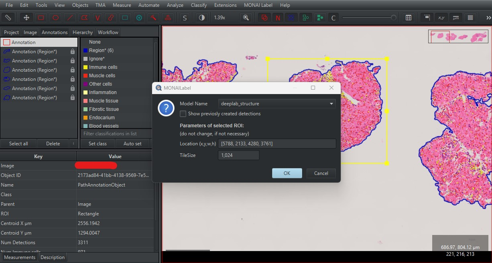
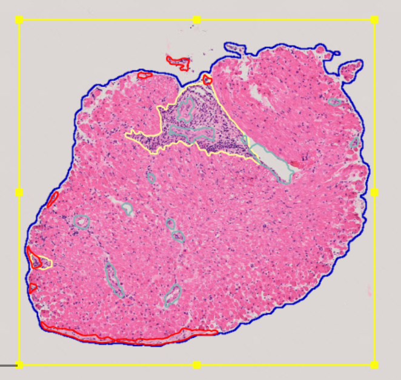

# Segmentácia v QuPath

Na vykonanie segmentácie vyšších morfologických štruktúr importujte snímky WSI(Whole Slide Imaging) do projektu QuPath, ktorý ste si stiahli počas inštalácie.

1. Vytvorte anotácie pre tkanivo a bunky spolu s ich klasifikáciami. Pre tento krok môžete použiť stiahnutý skript.

    Na použitie stiahnutého skriptu  `Tissue detection and cell detection.groovy` ho otvorte v paneli `Automate` > `Show script editor`. Po otvorení `Script editor` vyberte `File` > `Open...`  a vyberte adresár, kde sa nachádzajú stiahnuté skripty. Vyberte skript `Tissue detection and cell detection.groovy`. Po načítaní skriptu vyberte možnosť `Run` , aby ste vykonali segmentáciu tkaniva a buniek a klasifikáciu buniek.

2. Vyberte oblasť snímku, pre ktorú chcete vykonať predikciu.

    

3. Vyberte  `MONAI Label` > `Create annotations...` a potom vyberte model, ktorý chcete použiť pre predikciu v sekcii `Model Name`.

    Momentálne dostupné modely sú:
    - `deeplab_structure` - DeepLabV3+ na predikciu ciev, zápalu a endokardu v obrázkoch H&E
    - `nestedunet_structure` - U-Net++ na predikciu ciev, zápalu a endokardu v obrázkoch H&E
    - `srel_segmentation` - U-Net na predikciu endokardia v obrázkoch SRel

    Po vybratí modelu stlačte `OK`.

    

4. Po dokončení predikcie sú výsledky k dispozícii v QuPath, kde môžete upravovať, mazať alebo manuálne pridávať chýbajúce anotácie.

    

Pre výber anotácií, ktoré chceme vymazať je potrebné spustiť `Selection mode` výberom možnosti `S` v paneli. Po povolení  `Selection mode` je možné využiť rôzne spôsoby výberu, či už s využitím obdĺžnika alebo pomocou štetca (brush). Pre zrušenie `Selection mode` kliknite opätovne možnosť `S`.

