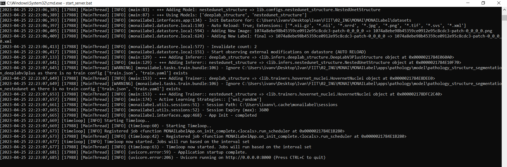

# Spustenie servera

## S použitím Docker-u

Odporúčaný spôsob spustenia servera je pomocou Docker-u:

```bash
docker run --gpus all --rm -ti -p 8000:8000 xvykopal/monailabel-server:latest bash
```

alebo môžete použiť nasledujúci príkaz, ak ste stiahli zdrojový kód:

```bash
docker compose up
```

## Lokálne bez Dockeru

Druhý spôsob spustenia servera je pomocou poskytnutého skriptu `start_server.bat`, ktorý môžete spustiť nasledujúcim príkazom:

```bash
start_server
```

Postup na spustenie servera bez inštalácie Docker-u:

1. Otvorte adresár so zdrojovým kódom pre MONAI Label.

    

2. Namiesto cesty k súboru zadajte v prieskumníkovi príkaz `cmd`.

    

3. Po zobrazení konzoly zadajte príkaz `start_server.bat` na spustenie servera.

    

4. Po úspešnom spustení servera by ste mali vidieť nasledujúci výstup v konzole.

    

Ak sa server nespustí, je potrebné spustiť ho manuálne pomocou nasledujúcich príkazov.

Pred spustením servera aktivujte Python prostredie:

- `venv`

 ```bash
 .venv/monailabel/Scripts/activate
 ```

- `conda`

 ```bash
 conda activate monailabel
 ```

Na spustenie servera:

```bash
monailabel/scripts/monailabel start_server --app apps/pathology --studies datasets/
```
